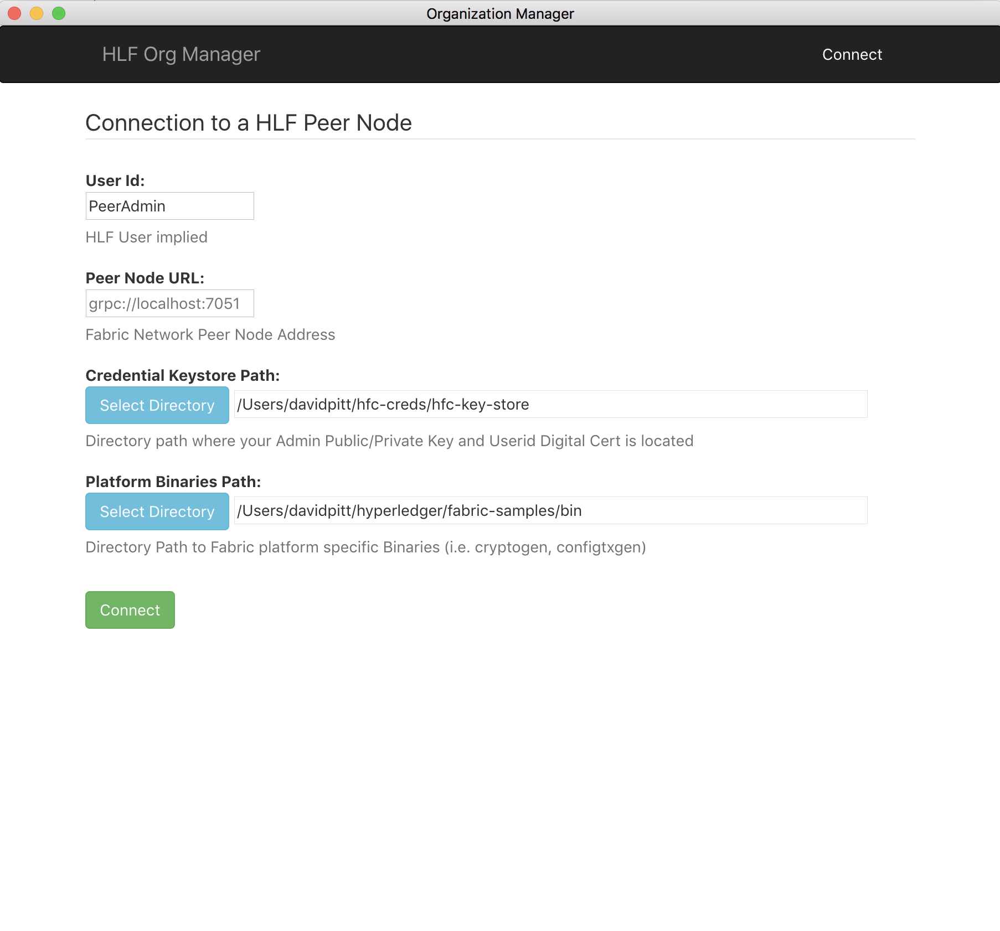
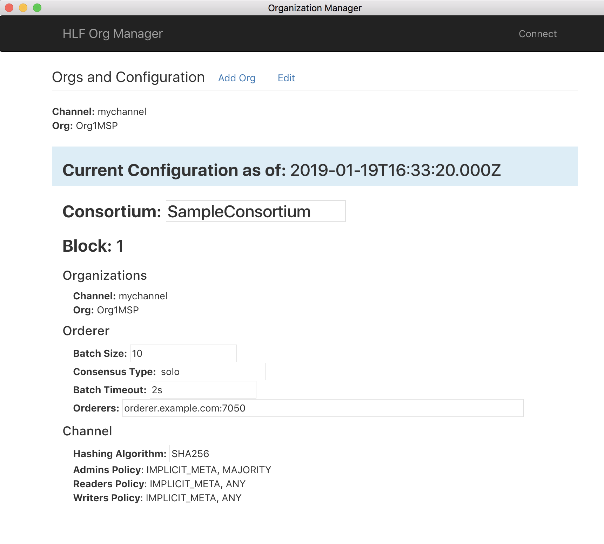
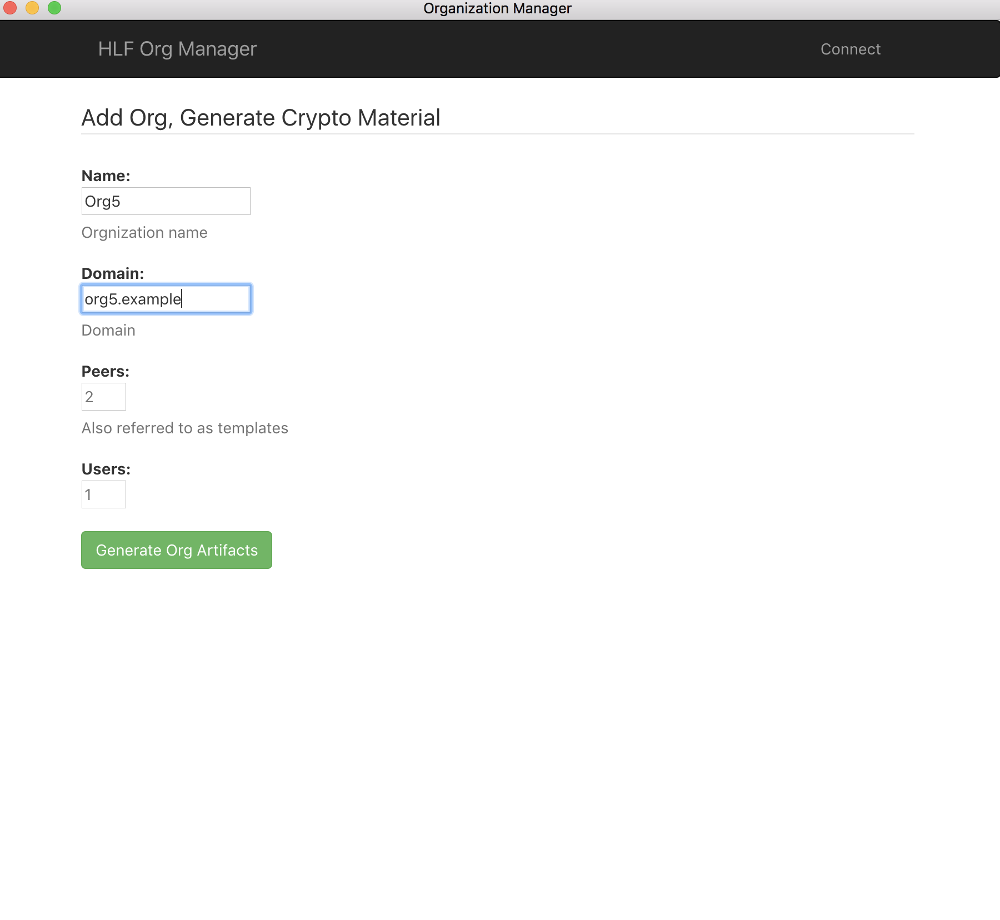
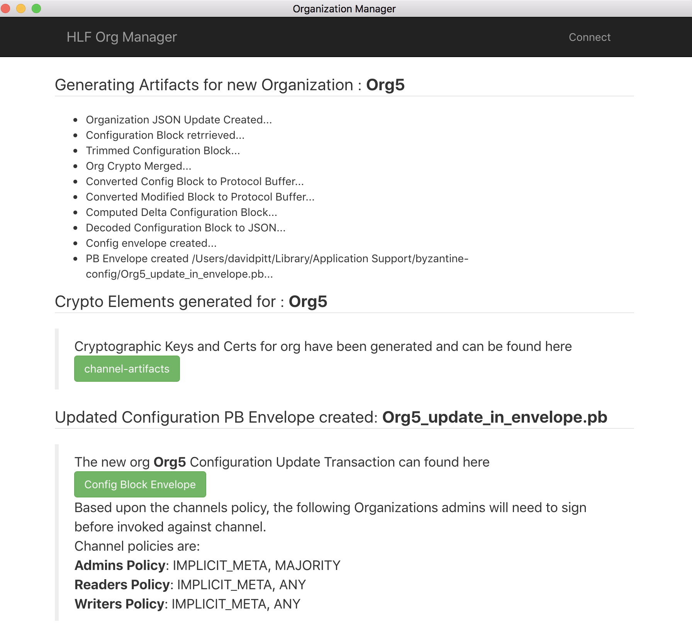

# byzantine-config-source

Hyperledger Fabric Network Configuration Manager allowing configuration blocks to be created to add Organizations, and update network configuration properties.

A desktop application implemented using Electron and ReactJS. 

Pre-built executable binaries are available in this [repo](https://github.com/in-the-keyhole/byzantine-config) 

### Installing and Starting 

    $ npm install 

    $ npm run electron-dev
       
### Build Exectuable 

    $ sudo npm run electron-pack 

Binaries are created and placed in the `dist` folder.  Pre-built executable binaries can be found [here](https://github.com/in-the-keyhole/byzantine-config).

`NOTE:`  This configuration tool utilizes **_cryptogen_** and **_configtxgen_** binaries provided by the *fabric-samples* project.  These binaries are not able to run directly on a windows platform, so the executables generated by this project will not work properly on a windows platform. 

### Usage 

Updating a Hyperledger Fabric network configuration (and/or  adding/updating organizations) requires a configuration block to be defined, signed and then executed as an update config transaction. Doing this manually with CLI tools can be complex and cumbersome.   

Byantine-config provides an executable `GUI` application that greatly simplifies updating and adding Organizations. When invoked an initial connect screen will appear.  You will need a network peer node address, Userid, access to your private key, and Fabric Binaries 

#### Initial Screen:
Select the directories containing your HLF credentials, and platform binaries, then click the `Connect` button.


#### View Current Config
Once connected, the current HLF configuration block information is displayed:


#### Create a new organization
Click the `Add Org` link and the UI will prompt you for the new organization name and properties. Enter your values, then click the `Generate Org Artifacts` button.


#### Verify generated artifacts
The newly generated crypto artifacts (as well as an `updated config block <your_org_name>_update_in_envelope.pb` file) for your organization will be on disk.  This screen allows you to open the containing folders to verify their existence and contents.


#### Sign the PB file
The config PB file will need to be signed by the consortium (based upon policy settings). To do this, the following command must be issued:
```peer channel signconfigtx -f /path/to/file/<your_org_name>_update_in_envelope.pb```

This can be accomplished in one of two ways:

1. Connect a shell/terminal to the CLI container for HLF, and issue the command.  *Note:  this approach also requires you to expose the .pb file to the running container.  This can be accomplished by copying it into an already mapped folder (check your docker compose yaml file and look for the mapped volumes, copy it to one of those folders).*
2. Install the HLF binaries onto your system and issue the command from a command prompt.

#### Execute an `update` transaction in HLF
Now that the PB file has been signed, it is time to issue the update to the HLF config.  The following command must be issued:

```peer channel update -f /path/to/file/<your_org_name>_update_in_envelope.pb -c $CHANNEL_NAME -o $ORDERER_ADDRESS:$ORDERER_PORT --tls --cafile $ORDERER_CA```

This example uses pre-set environment variables, as follows:
* $CHANNEL_NAME: the name of the channel to execute the update against.  (e.g. mychannel)
* $ORDERER_ADDRESS: the domain name location of the orderer node (e.g. orderer.example.com)
* $ORDERER_PORT: the port number on which the orderer is listening (e.g. 7050)
* $ORDERER_CA: the path to the generated .pem file for the new organization (e.g. /path/to/file/<your_org_name>/tlsca/tlsca.<your_org_name>-cert.pem)

You may certainly skip the use of environment variables and substitute the correct values in the command, instead.

#### Verify
Upon successfull execution of the `update` command (above), you should see a message similar to the following:

`Successfully submitted channel update`

You can verify the execution by inspecting the latest/current HLF configuration block.
